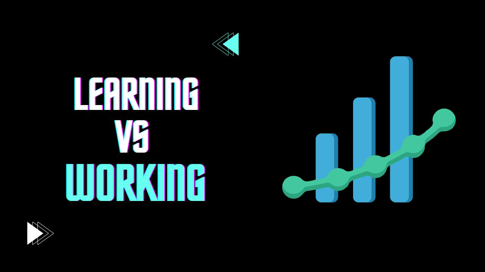

Data science has become one of the most sought-after skills, attracting learners from various backgrounds. Many start their data science journey through online courses, textbooks, and tutorials, but there’s a big leap between learning data science in theory and applying it in the real world.

## 1. **Problem Definition: From Structured to Unstructured**

- **In Learning**: Problems in data science courses are often well-defined. You know exactly what’s expected of you, whether it's to build a model to classify images or predict housing prices. The scope is clear, and the dataset usually aligns perfectly with the problem at hand.
- **In Real Life**: You often start with a vague or ambiguous business problem, such as “Why are customers leaving?” or “How can we increase sales?” Defining the problem itself requires close interaction with stakeholders and a deep understanding of the business. You are responsible for figuring out what’s important and how data can help solve it.

## 2. **Data Quality: Clean vs. Messy**

- **In Learning**: Most datasets you work with in tutorials or assignments are already cleaned, well-structured, and ready to use. Missing values, if any, are noted upfront, and outliers are either non-existent or easy to identify.
- **In Real Life**: Data is rarely clean. You will face challenges like missing values, duplicate records, incorrect entries, and large, unstructured datasets. Much of your time may be spent wrangling and cleaning data to make it usable. Data wrangling skills become critical as real-world data is often collected from various sources in inconsistent formats.

<!-- inline-square -->

<ins class="adsbygoogle"
     style="display:block"
     data-ad-client="ca-pub-8076040302380238"
     data-ad-slot="3564352555"
     data-ad-format="auto"
     data-full-width-responsive="true"></ins>

## 3. **Tools and Technologies: Simplicity vs. Complexity**

- **In Learning**: Most learners start with user-friendly tools like Jupyter Notebooks and well-documented libraries like `pandas` and `scikit-learn`. The goal is to focus on the core concepts and algorithms without the overhead of complex tools.
- **In Real Life**: You will likely need to work with more complex data pipelines and tools like Apache Spark, Airflow, or cloud platforms like AWS and Google Cloud. Production environments require scaling, automation, and robust data engineering practices, which can make the tools more intricate.

## 4. **Time Constraints: Academic Deadlines vs. Business Deadlines**

- **In Learning**: You generally work within academic deadlines, where assignments have predefined timelines, but you can work at your own pace. There's also a clear "right answer" in most cases, whether it’s an accuracy score or a regression output.
- **In Real Life**: Time is a major factor. Businesses often expect quick turnarounds, and delays can cost money or slow down decision-making. Unlike in learning, there’s often no single “right answer,” and you may need to deliver results even when the data is incomplete or imperfect.

<!-- inline-square -->

<ins class="adsbygoogle"
     style="display:block"
     data-ad-client="ca-pub-8076040302380238"
     data-ad-slot="3564352555"
     data-ad-format="auto"
     data-full-width-responsive="true"></ins>

## 5. **Collaboration: Solo vs. Cross-Functional Teams**

- **In Learning**: Learning data science tends to be an individual experience, where you work on projects solo or in small groups with peers who share similar skills.
- **In Real Life**: Data science in the workplace is highly collaborative. You will work with product managers, software engineers, business analysts, and other departments to gather data, define problems, and implement solutions. Strong communication skills are essential to explain your insights and models to non-technical stakeholders.

## 6. **End-to-End Solutions: Focus vs. Breadth**

- **In Learning**: Most courses focus on specific parts of the data science workflow, such as data visualization or building machine learning models. You rarely need to think about the entire lifecycle of a project.
- **In Real Life**: You are responsible for the entire process, from understanding the business problem, collecting data, building models, validating results, to deploying the model into production. You also have to consider how the model will be maintained, updated, and monitored for long-term use.

<!-- inline-square -->

<ins class="adsbygoogle"
     style="display:block"
     data-ad-client="ca-pub-8076040302380238"
     data-ad-slot="3564352555"
     data-ad-format="auto"
     data-full-width-responsive="true"></ins>

## 7. **Metrics and Evaluation: Academic Metrics vs. Business Impact**

- **In Learning**: You evaluate your models based on predefined metrics like accuracy, precision, recall, or F1-score. The dataset is static, and the goal is to maximize performance on the given data.
- **In Real Life**: Business decisions are influenced by your models, and the metrics might vary depending on the problem. Sometimes it’s more important to focus on precision rather than accuracy, or to use business-specific key performance indicators (KPIs). The model's performance is evaluated in the context of business outcomes, not just technical metrics.

## 8. **Decision-Making and Impact: No Consequence vs. High Stakes**

- **In Learning**: The outcome of your projects has little to no real-world consequence. If your model doesn’t perform well, you lose points, but there’s no long-term impact.
- **In Real Life**: Your work directly impacts business decisions, customer satisfaction, and the company's bottom line. For example, a poorly designed churn prediction model could lead to customer loss, while a well-optimized marketing model could save the company millions.

<!-- inline-square -->

<ins class="adsbygoogle"
     style="display:block"
     data-ad-client="ca-pub-8076040302380238"
     data-ad-slot="3564352555"
     data-ad-format="auto"
     data-full-width-responsive="true"></ins>

## 9. **Continuous Learning: Structured vs. Dynamic**

- **In Learning**: You follow a structured learning path, with courses, books, and exercises guiding you through the fundamentals of data science.
- **In Real Life**: The field evolves rapidly, and you must keep learning new techniques, tools, and methodologies. Additionally, real-life projects often require domain-specific knowledge (e.g., healthcare, finance), pushing you to expand beyond core data science skills.

## 10. **Documentation and Maintenance: Submit and Forget vs. Ongoing Responsibility**

- **In Learning**: Once you submit an assignment or project, you typically move on to the next one without worrying about its future.
- **In Real Life**: Proper documentation and maintainability are crucial. Code needs to be understandable not just for you but for the entire team, and models in production require regular monitoring and updates to ensure they remain accurate as new data comes in.

<!-- inline-square -->

<ins class="adsbygoogle"
     style="display:block"
     data-ad-client="ca-pub-8076040302380238"
     data-ad-slot="3564352555"
     data-ad-format="auto"
     data-full-width-responsive="true"></ins>

## Bridging the Gap

Learning data science provides the foundational skills you need, but working in the field is a whole new challenge. To succeed in real-life data science, you must go beyond algorithms and coding. You need to understand business problems, work with messy data, collaborate with diverse teams, and constantly adapt to new tools and technologies. It’s this combination of technical skills and problem-solving abilities that will make you a successful data scientist in the real world.

By preparing for these differences, you can make a smoother transition from learning data science to applying it effectively in your career.

<h2>What's on your mind? Put it in the comments!</h2>

<h2>You may also like:</h2>
<a href="/posts/2024/staying-motivated-as-a-programmer/">
<h4>How to stay motivated as a Programmer</h4>

</a>

