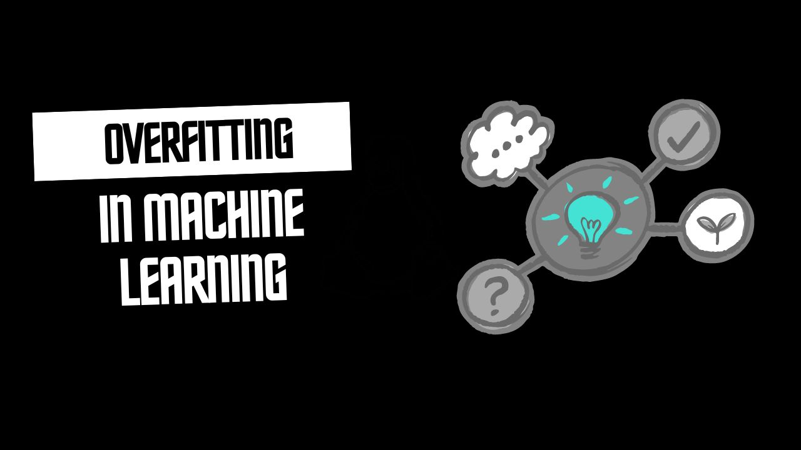
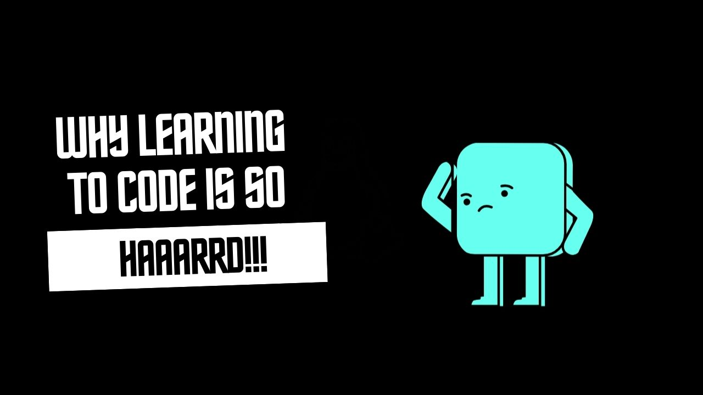

Machine learning models are designed to make accurate predictions by learning patterns from data. However, there’s a common pitfall known as **overfitting**, where a model performs exceptionally well on training data but fails to generalize to new, unseen data. This blog will explore what overfitting is, its causes, and how to address it effectively.

---

## What is Overfitting?

Overfitting occurs when a machine learning model becomes too complex, capturing noise and random fluctuations in the training data rather than the underlying data distribution. As a result, the model learns not just the signal (the true patterns) but also the noise (irrelevant details), leading to poor performance on new data.

**Example:** Imagine you’re trying to teach a child to recognize different types of animals. If you only show them pictures of cats, they might start recognizing patterns like specific fur colors or even the background in those pictures. If they encounter a cat that doesn’t fit the exact pattern they’ve learned, they might fail to recognize it. This is akin to overfitting in machine learning.

---

<!-- Newsletter -->

<h4><i class="bi bi-info-circle-fill"></i> Don't Miss Any Updates!</h4>

Before we continue, I have a humble request, to be among the first to hear about future updates of the course materials, simply enter your email below, follow us on <a href="https://x.com/dataideaorg"><i class="bi bi-twitter-x"></i>
(formally Twitter)</a>, or subscribe to our <a href="https://www.youtube.com/@dataideaorg"><i class="bi bi-youtube"></i> YouTube channel</a>.

<iframe class="newsletter-frame" src="https://embeds.beehiiv.com/5fc7c425-9c7e-4e08-a514-ad6c22beee74?slim=true" data-test-id="beehiiv-embed" height="52" frameborder="0" scrolling="no">
</iframe>

## Causes of Overfitting

Overfitting can occur due to several factors, most of which revolve around the complexity of the model and the nature of the data:

1. **Complex Models:**

   - Models with too many parameters relative to the amount of training data are prone to overfitting. For instance, a deep neural network with many layers can memorize the training data, capturing noise instead of general patterns.

2. **Insufficient Data:**

   - When there’s not enough data to represent the underlying distribution adequately, the model might infer patterns that don’t exist, leading to overfitting. In such cases, the model learns to fit the training data too closely.

3. **Noise in Data:**

   - Real-world data often contains noise—random errors, irrelevant features, or outliers. If a model learns these noisy patterns as if they were significant, it can perform poorly on new data.

4. **Lack of Regularization:**

   - Regularization techniques help prevent overfitting by penalizing overly complex models. Without regularization, models are free to become too intricate, fitting the training data too closely.

5. **High Dimensionality:**
   - When the number of features (dimensions) is very high, the model has more opportunities to find spurious correlations, leading to overfitting. This is often referred to as the "curse of dimensionality."

---

<!-- inline-square -->

<ins class="adsbygoogle"
     style="display:block"
     data-ad-client="ca-pub-8076040302380238"
     data-ad-slot="3564352555"
     data-ad-format="auto"
     data-full-width-responsive="true"></ins>

## Detecting Overfitting

Detecting overfitting involves comparing the model’s performance on the training data versus its performance on validation or test data:

- **Training vs. Validation Loss:**

  - If the model’s loss (error) on the training data continues to decrease while the validation loss starts to increase, it’s a clear sign of overfitting.

- **Cross-Validation:**
  - Using techniques like k-fold cross-validation, where the model is trained and validated on different subsets of the data, can help detect overfitting. If the model performs well on the training folds but poorly on the validation folds, it indicates overfitting.

---

<!-- inline-square -->

<ins class="adsbygoogle"
     style="display:block"
     data-ad-client="ca-pub-8076040302380238"
     data-ad-slot="3564352555"
     data-ad-format="auto"
     data-full-width-responsive="true"></ins>

## Strategies to Prevent and Mitigate Overfitting

While overfitting is a common issue, several strategies can help prevent or reduce its impact:

1. **Simplifying the Model:**

   - Reducing the model’s complexity—fewer parameters or layers—can help avoid overfitting. A simpler model is less likely to memorize the training data and more likely to generalize well.

2. **Regularization Techniques:**

   - **L1 and L2 Regularization:** These techniques add a penalty to the loss function, discouraging the model from becoming too complex. L1 regularization (Lasso) encourages sparsity, while L2 regularization (Ridge) penalizes large coefficients.
   - **Dropout:** In neural networks, dropout randomly disables a fraction of neurons during training, forcing the network to learn more robust features rather than relying on specific neurons.

3. **Early Stopping:**

   - During training, the model’s performance on validation data is monitored, and training is halted when the performance stops improving. This prevents the model from learning noise after it has captured the general patterns.

4. **Cross-Validation:**

   - Cross-validation, especially k-fold cross-validation, helps ensure the model generalizes well to different subsets of the data, reducing the risk of overfitting.

5. **Data Augmentation:**

   - In cases of limited data, data augmentation techniques (e.g., rotating, flipping images) can artificially expand the dataset, helping the model learn more generalizable features.

6. **Feature Selection:**

   - Reducing the number of input features to only those most relevant to the task can help prevent overfitting. Techniques like Principal Component Analysis (PCA) or manual feature selection can be used.

7. **Adding More Data:**
   - If possible, increasing the size of the training dataset can help the model learn the underlying patterns better, reducing the likelihood of overfitting.

<h2>What's on your mind? Put it in the comments!</h2>

<h2>You may also like:</h2>
<a href="/posts/2024/why-coding-is-hard/">
<h4>Why learning to code can be hard and how to go about it.</h4>

</a>

