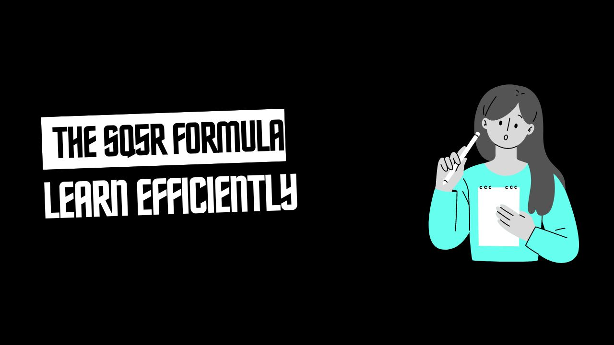

During my Form 3 class, I stumbled upon an effective study technique in James Kalat's _Introduction to Psychology_. This method, known as the SQ5R formula, has become an essential tool in my learning arsenal, especially for mastering programming concepts. If you're striving to enhance your programming skills, applying the SQ5R technique can be incredibly beneficial.

### What is SQ5R?

SQ5R stands for Survey, Question, Read, Recite, Relate, Review, and Reflect. It’s a structured approach designed to boost comprehension and retention. Here’s how each step can be applied to learning programming:

1. **Survey**
   Begin by surveying the material. For a programming topic, this could involve skimming through documentation, reading over code examples, or reviewing the structure of a programming tutorial. This initial survey gives you a broad overview of what you’re about to dive into.

2. **Question**
   Formulate specific questions about the programming concepts you're learning. Ask yourself what the main objectives of the topic are, what key functions or methods are involved, and how these concepts fit into the bigger picture of programming. This step helps you focus and directs your learning.

3. **Read**
   Read the material thoroughly, keeping your questions in mind. Whether it's a textbook, online tutorial, or code documentation, actively engage with the content. Pay close attention to code snippets, explanations, and examples.

4. **Recite**
   After reading a section, try to recite or write down the key points and code snippets you’ve learned. This could involve explaining how a function works or outlining the steps in an algorithm. Reciting helps reinforce your understanding and ensures you’ve grasped the core concepts.

5. **Relate**
   Relate new programming concepts to what you already know. For example, if you're learning about object-oriented programming, relate it to real-world objects or previous programming paradigms you're familiar with. Making these connections helps solidify your understanding and makes the material more meaningful.

6. **Review**
   Periodically review the material you’ve covered. Revisit your notes, code examples, and key concepts. Regular reviews help reinforce your learning and keep information fresh, which is crucial for programming, where concepts build on each other.

7. **Reflect**
   Reflect on how the new programming concepts fit into your overall skill set. Consider how they apply to real-world problems or projects you’re working on. Reflection helps you see the bigger picture and understand the practical applications of what you’ve learned.

### Why SQ5R Works for Programming

The SQ5R method is particularly effective for programming because it promotes active engagement with the material. By surveying, questioning, and relating new concepts, you develop a deeper understanding. Reciting and reviewing help in reinforcing your knowledge, while reflection ties everything together, making your learning more coherent and applicable.

### Conclusion

For anyone looking to improve their programming skills, the SQ5R formula is a valuable tool. It encourages active learning and deeper comprehension, making it easier to grasp and retain complex programming concepts. Give it a try in your next study session and see how it enhances your programming mastery!

Feel free to share your experiences with the SQ5R method or ask questions in the comments below!
