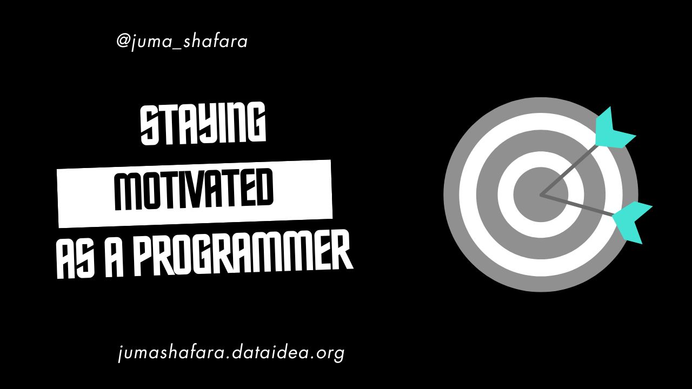

Programming is a rewarding and fulfilling career, but staying motivated can sometimes be a challenge. As a programmer myself, I understand the ups and downs of a programmer's journey. Whether you're a seasoned developer or just starting your coding adventure, here are some tips to help you stay motivated and enthusiastic about your work.

## 1. Set Clear Goals

**Short-term Goals:** Breaking down large projects into manageable tasks can help maintain a sense of progress. Tackling smaller tasks allows you to celebrate frequent victories, which can keep your spirits high.

**Long-term Goals:** Having a vision for your career or projects can help you stay focused on the bigger picture. Whether it's mastering a new language, building a complex application, or advancing in your career, clear long-term goals provide direction and purpose.

## 2. Embrace Continuous Learning

**Stay Updated:** The tech industry evolves rapidly. Stay updated by following industry news, reading blogs, and keeping up with the latest trends and technologies. This will keep you engaged and excited about new developments.

**Take Courses:** Enroll in online courses to learn new programming languages, tools, or methodologies. Continuous learning not only enhances your skills but also keeps your passion for programming alive.

## 3. Work on Passion Projects

**Personal Projects:** Building something you're passionate about can be incredibly motivating. Whether it's a game, an app, or a tool, working on personal projects allows you to explore your interests and creativity.

**Open Source:** Contributing to open-source projects enables you to collaborate with other developers, learn from them, and make meaningful contributions to the community. It's a great way to stay motivated and connected.

<!-- inline-square -->

<ins class="adsbygoogle"
     style="display:block"
     data-ad-client="ca-pub-8076040302380238"
     data-ad-slot="3564352555"
     data-ad-format="auto"
     data-full-width-responsive="true"></ins>

## 4. Join a Community

**Networking:** Attend meetups, conferences, or join online forums like Stack Overflow, GitHub, or Reddit. Engaging with fellow developers can provide support, inspiration, and valuable insights.

**Mentorship:** Seek mentorship from experienced developers or become a mentor to others. Sharing knowledge and experiences can be motivating and enriching for both mentors and mentees.

## 5. Maintain Work-Life Balance

**Breaks:** Taking regular breaks is crucial to avoid burnout. Techniques like Pomodoro can help maintain productivity while ensuring you rest adequately.

**Hobbies:** Engaging in hobbies outside of programming can refresh your mind and prevent monotony. Whether it's sports, reading, or any other interest, having a life outside of coding is essential.

## 6. Celebrate Achievements

**Milestones:** Celebrate when you complete significant tasks or achieve milestones. Recognizing your achievements, no matter how small, can boost your confidence and motivation.

**Rewards:** Treat yourself to something enjoyable after accomplishing a challenging goal. It could be a nice meal, a new gadget, or a short trip—rewarding yourself can reinforce positive behavior.

<!-- inline-square -->

<ins class="adsbygoogle"
     style="display:block"
     data-ad-client="ca-pub-8076040302380238"
     data-ad-slot="3564352555"
     data-ad-format="auto"
     data-full-width-responsive="true"></ins>

## 7. Stay Organized

**Task Management:** Use tools like Trello, Asana, or JIRA to keep track of tasks and deadlines. Staying organized helps you manage your workload efficiently and reduces stress.

**Workspace:** Maintain a clean and organized workspace to stay focused. A clutter-free environment can enhance productivity and motivation.

## 8. Seek Feedback

**Code Reviews:** Participate in code reviews to get constructive feedback and improve your skills. Learning from others can help you grow and stay motivated.

**User Feedback:** Gather feedback from users to see the impact of your work. Knowing that your code makes a difference can be incredibly inspiring.

## 9. Teach and Share Knowledge

**Blogging/Vlogging:** Writing blog posts or creating video tutorials to share your knowledge and experiences can reinforce your understanding and passion for programming.

**Teaching:** Conduct workshops or teach programming to beginners. Seeing others benefit from your knowledge and efforts can be extremely rewarding and motivating.

<!-- Newsletter -->

<h4><i class="bi bi-info-circle-fill"></i> Don't Miss Any Updates!</h4>

Before we continue, I have a humble request, to be among the first to hear about future updates of the course materials, simply enter your email below, follow us on <a href="https://x.com/dataideaorg"><i class="bi bi-twitter-x"></i>
(formally Twitter)</a>, or subscribe to our <a href="https://www.youtube.com/@dataideaorg"><i class="bi bi-youtube"></i> YouTube channel</a>.

<iframe class="newsletter-frame" src="https://embeds.beehiiv.com/5fc7c425-9c7e-4e08-a514-ad6c22beee74?slim=true" data-test-id="beehiiv-embed" height="52" frameborder="0" scrolling="no">
</iframe>

## 10. Stay Inspired

**Success Stories:** Read about successful projects and developers to draw inspiration. Learning about others' achievements can motivate you to strive for success.

**Quotes:** Keep motivational quotes or success stories around your workspace. A little inspiration can go a long way in maintaining your drive.

At DATAIDEA, we believe in the power of community and continuous learning. By implementing these strategies, you can stay motivated and thrive in your programming journey. Remember, every small step forward is progress, and staying motivated is key to long-term success.

---

Feel free to share your own tips and experiences in the comments. Let's keep each other motivated and inspired!

