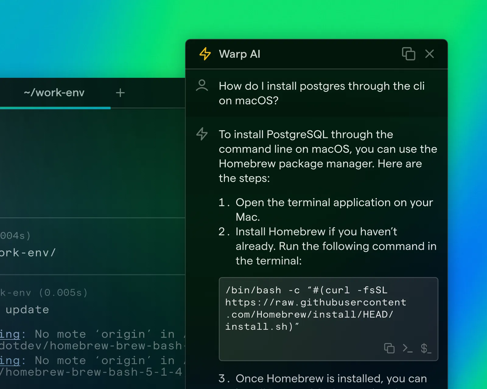
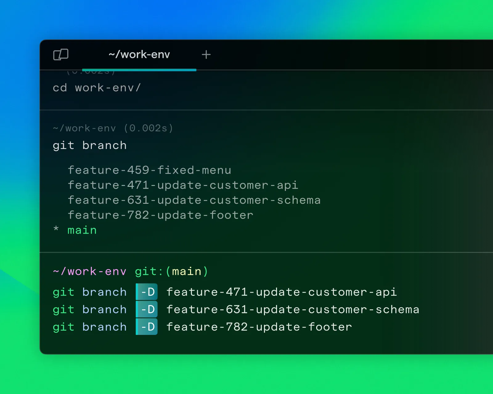

In the rapidly evolving tech landscape, having tools that streamline the development process is key to staying productive and focused. Recently, I decided to dive into Warp, a modern terminal emulator built with Rust, which has been making waves for its innovative features and AI integration. Here’s my personal take on Warp after incorporating it into my daily workflow.

### First Impressions

I first heard about Warp through various tech blogs and was intrigued by its strong opinions on how a terminal should function. After requesting an invite on their [official site](https://www.warp.dev), I received an email a few weeks later inviting me to download it. From the moment I opened Warp, it was clear that this was not your typical terminal emulator. The clean, modern interface and the intuitive Command Palette set the stage for a unique experience.

### Key Features I Loved

**1. AI Integration:**
One of Warp’s standout features is its AI-powered functionality. The AI offers smart completions, command suggestions, and even programming guidance. This has significantly reduced my need to search for commands or debug errors externally, making my workflow smoother and more efficient.

**2. Command Blocks:**
Warp’s approach to handling commands in distinct blocks was a game-changer for me. Each command runs as an independent unit that you can manipulate through the UI. This organization makes it easier to manage and interact with command history and outputs. The visual separation between commands helps keep everything tidy and easy to navigate.

**3. Collaboration Tools:**
Sharing workflows has never been easier. Warp allows you to generate links to specific command blocks, which you can then share with colleagues or use during coding meetups and classes. This feature is particularly useful for collaborative projects and teaching scenarios.

**4. Modern Editing Capabilities:**
Warp brings modern editing features to the terminal, akin to working within an IDE. It supports default keybindings and Vim, catering to both keyboard-centric users and those who prefer using a mouse. The Command Palette is a fast and efficient way to access all the commands you need.

### Daily Usage and Performance

Testing Warp on my 16-inch MacBook Pro with 32 GB of RAM, I found its performance to be on par with iTerm2, handling even heavy loads and complex setups with ease. Warp is just as fast, if not faster, and offers a level of stability that is impressive for such a new tool.

### Areas for Improvement

While I have enjoyed using Warp, there are a few areas where it could improve:

**1. Space Utilization:**
The block-based interface, while innovative, does take up more screen space compared to traditional terminals. Even with "compact mode" enabled, I sometimes miss the more streamlined view of other terminals like iTerm2.

**2. Customization:**
Warp offers a selection of themes and fonts, but the options are limited. As someone who likes to tweak and customize my tools extensively, I found the lack of deeper customization options a bit disappointing. Additionally, the absence of support for custom plugins is a drawback for those looking to extend Warp's functionality further.

**3. Feature Completeness:**
Some of the game-changing features, such as advanced collaborative tools and approval workflows, are still in development. While the current features are impressive, I’m looking forward to these additions that promise to make Warp even more powerful.

If you’re interested in trying Warp, you can find more detailed insights and reviews on [Mat Duggan's blog](https://matduggan.com/warp-terminal-emulator-review/) and [DEV Community](https://dev.to/bartzalewski/review-of-warp-the-ai-powered-terminal-2j5e).

---

This review is based on my personal experience with Warp. My aim is to share valuable tools that have significantly impacted my productivity as a developer.
