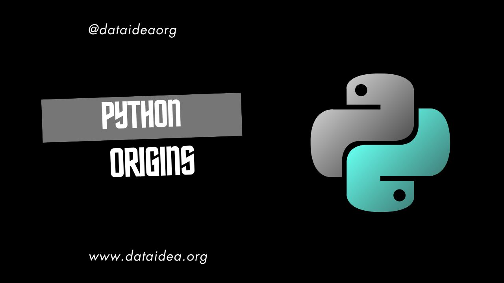
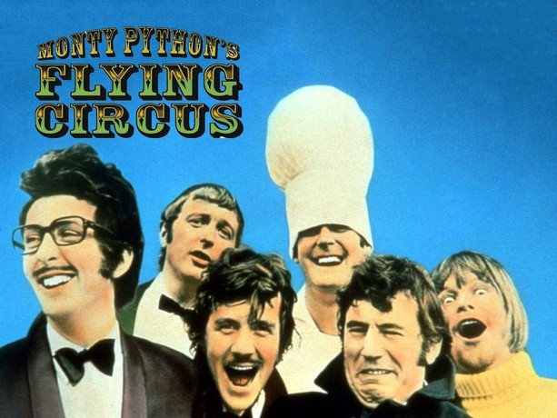

While most programming languages are named after concepts, acronyms, or technical jargon, Python has a name that is both unique and intriguing. So, how did this powerful and popular language get its name? Let me tell you the story behind Python’s moniker.

### The Beginning of Python

The tale begins with Guido van Rossum, a Dutch programmer who was working at Centrum Wiskunde & Informatica (CWI) in the Netherlands in December 1989. Van Rossum, an accomplished programmer with a deep interest in creating user-friendly programming languages, was seeking a project to engage in during the Christmas holidays. He wanted to create a language that would overcome some of the limitations he saw in ABC, a language developed at CWI that he admired but found lacking in certain areas, particularly extensibility.

Van Rossum's new language was designed to be both powerful and easy to use, incorporating features he valued and aiming to address ABC’s shortcomings. As he embarked on this project, one crucial element remained: choosing a name.

### A Nod to Monty Python

Guido van Rossum had a penchant for humor, and he was a huge fan of the British comedy troupe Monty Python. Monty Python’s Flying Circus, a television show that aired from 1969 to 1974, is renowned for its surreal and absurd humor. The show had a significant cultural impact, and its quirky, unconventional style resonated with Van Rossum.

In his quest for a name, Van Rossum wanted something short, distinctive, and a little offbeat—something that would stand out in the world of programming languages. In a stroke of inspiration, he decided to name his new language "Python," in tribute to the Monty Python series. This choice reflected his sense of humor and added a touch of personality to the language he was creating.

### The Birth of Python

Python was officially released to the public in February 1991. From its inception, the language emphasized code readability and simplicity. It featured significant whitespace, which helped to improve the clarity and structure of code. This design philosophy made Python accessible to beginners while also appealing to experienced developers.

The name "Python" soon became synonymous with these qualities. The playful choice of name also contributed to Python’s identity, setting it apart from more traditionally named languages and endearing it to a broad audience.

### A Cultural Legacy

The influence of Monty Python’s humor extends beyond the language’s name. The Python community has embraced this connection, often referencing Monty Python sketches in tutorials, documentation, and even language features. The playful spirit of Monty Python is evident in the community's approach to programming, fostering a culture of creativity and fun.

### About Me

Hi, My name is Juma Shafara. Am a Data Scientist and Instructor at DATAIDEA. I have taught hundreds of peope Programming, Data Analysis and Machine Learning. I also enjoy developing innovative algorithms and models that can drive insights and value. I regularly share some content that I find useful throughout my learning/teaching journey to simplify concepts in Machine Learning, Mathematics, Programming, and related topics. Besides these technical stuff, I enjoy watching soccer, movies and reading mystery books.

<h2>What's on your mind? Put it in the comments!</h2>

